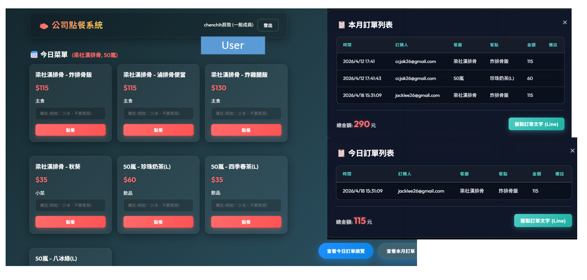

# Company Meal Ordering Tool / 公司內部點餐工具

[English](#english) | [繁體中文](#繁體中文)

---

## English

An internal company meal ordering web application built with HTML, CSS, and Vanilla JavaScript. It uses Google Identity Services for user authentication and Google Sheets API as a backend database for managing menus, users, and orders.



### Features

*   **Google Account Integration**: Secure login using Google Identity Services.
*   **Google Sheets Database**: Completely serverless. Menus, users, and orders are all managed within a Google Spreadsheet.
*   **Role-Based Access Control**: Different views and permissions for 'Admin' and 'Staff' (configured in the Sheets).
*   **Dynamic Menu System**: Admins can set which restaurants are available for the day, and the menu dynamically updates.
*   **Order Management**:
    *   Place orders with custom notes.
    *   View all orders for today or the entire month.
    *   Easily copy today's orders in a format ready to be pasted into Line or other messaging apps.
*   **Admin Dashboard**: Admins can configure available restaurants and clear daily orders.

### Configuration

To use this tool, you need to set up a project on Google Cloud Platform and create a Google Spreadsheet with specific sheets: `TodayConfig`, `Menu`, `Users`, and `Orders`.

In `all.js`, you must configure your credentials:

```javascript
const CONFIG = {
    CLIENT_ID: 'YOUR_GCP_CLIENT_ID',
    API_KEY: 'YOUR_GCP_API_KEY',
    SPREADSHEET_ID: 'YOUR_SPREADSHEET_ID',
    // ...
};
```

### Tech Stack
*   HTML5, CSS3, Vanilla JavaScript
*   Google Identity Services
*   Google Sheets API v4

---

## 繁體中文

這是一個採用 HTML、CSS 和純 JavaScript 開發的內部點餐網頁應用程式。採用 Google Identity Services 進行使用者身分驗證，並將 Google Sheets (試算表) 作為後端資料庫來管理菜單、使用者和訂單。


### 主要功能

*   **Google 帳號登入**：串接 Google Identity Services，提供安全便捷的登入方式。
*   **Google 試算表資料庫**：完全無伺服器 (Serverless) 架構。所有的菜單、使用者權限、點餐紀錄皆透過 Google Sheets 管理。
*   **權限分級控管**：根據試算表設定，區分「管理員」與「一般成員」權限與介面。
*   **動態菜單載入**：管理員可每天設定開放點餐的餐廳，系統將自動載入對應菜單。
*   **訂單管理**：
    *   點餐時可填寫備註 (如：少冰、不要香菜)。
    *   可總覽今日訂單與本月訂單，並自動計算總金額。
    *   提供「複製訂單文字」功能，排版格式適合直接貼上至 Line 群組。
*   **管理員專屬功能**：設定今日餐廳、一鍵清空今日點餐紀錄。

### 系統設定

使用本工具前，您需要至 Google Cloud Platform (GCP) 建立專案並取得 API 憑證，同時建立一個包含以下工作表的 Google 試算表：`TodayConfig` (今日設定)、`Menu` (菜單)、`Users` (使用者名單)、`Orders` (訂單清單)。

接著，您必須在 `all.js` 中填寫您的設定檔：

```javascript
const CONFIG = {
    CLIENT_ID: '您的_GCP_CLIENT_ID',
    API_KEY: '您的_GCP_API_KEY',
    SPREADSHEET_ID: '您的試算表_ID',
    // ...
};
```

### 本專案技術棧
*   HTML5, CSS3, Vanilla JavaScript
*   Google Identity Services
*   Google Sheets API v4
